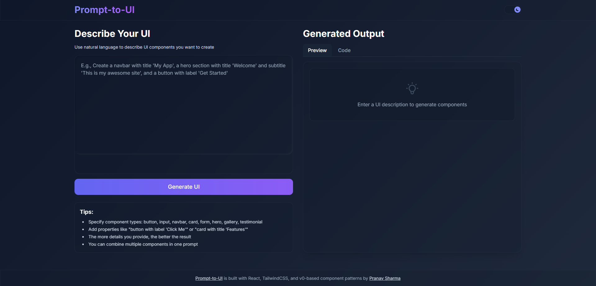

# 🚀 Prompt-to-UI

A modern web application that converts text prompts into UI components in real-time. Type a description in plain English and watch as beautiful UI components are rendered instantly.



## ✨ Features

- **Text-to-UI Conversion**: Enter a UI description in plain English and get instant UI components
- **Live Preview**: See your generated UI components in real-time
- **Code Generation**: Get the corresponding React code for your UI components
- **Component Library**: Support for buttons, inputs, cards, navbars, forms, heroes, galleries, testimonials
- **Responsive Design**: Works seamlessly on all device sizes
- **Dark/Light Theme**: Toggle between light and dark themes
- **Modern Design**: Glassmorphism effects, neumorphic shadows, and gradient accents

## 🖥️ Demo

You can try out the live demo of Prompt-to-UI here: [Live Demo](https://prompt-to-ui.vercel.app)

## 🛠️ Technologies Used

- **React**: Frontend library for building user interfaces
- **TailwindCSS**: Utility-first CSS framework for styling
- **Vite**: Next-generation frontend tooling for fast development
- **JavaScript**: Programming language for web interactivity

## 🌐 Live Website

- Watch website in action [here](https://prompt-to-ui.vercel.app/)

## 🔧 Installation

1. Clone this repository
```bash
git clone https://github.com/yourusername/Prompt-to-UI.git
cd Prompt-to-UI
```

2. Install dependencies
```bash
npm install
```

3. Start the development server
```bash
npm run dev
```

4. Open your browser and navigate to `http://localhost:5173`

## 🧠 How It Works

Prompt-to-UI uses pattern matching to interpret your text descriptions and convert them into UI components. It recognizes certain keywords and phrases to determine what components to generate and how they should be styled.

### Example Prompts

- "Create a button with label 'Submit'"
- "Add a form with submit button 'Sign Up'"
- "Make a card with title 'Features' and content 'Our product has amazing features'"
- "Add a navbar with title 'My App'"
- "Create a hero section with title 'Welcome' and subtitle 'Join us today'"

## 🎨 Customization

You can customize the components by including specific properties in your prompts:

- **Buttons**: Specify the label text
- **Inputs**: Set the placeholder text
- **Cards**: Define the title and content
- **Forms**: Change the submit button text
- **Hero sections**: Set the title, subtitle, and button text

## 📱 Responsive Design

Prompt-to-UI is built with a mobile-first approach, ensuring that all generated components look great on any device size, from mobile phones to large desktop monitors.

## 🔮 Future Plans

- Add more component types (modals, sidebars, pagination, alerts)
- Implement more advanced natural language processing
- Add component drag and drop functionality
- Support for more design variations (Material Design, iOS style)
- Export components as reusable code snippets

## 👨‍💻 Contributing

Contributions are welcome! If you have ideas for new features or improvements, feel free to:

1. Fork the repository
2. Create a new branch
3. Make your changes
4. Submit a pull request

## 📄 License

This project is licensed under the MIT License - see the LICENSE file for details.

## 👤 Author

Created by [Pranav Sharma](https://www.linkedin.com/in/-pranav--sharma-/)

---

✨ If you like this project, please consider giving it a star! ⭐
